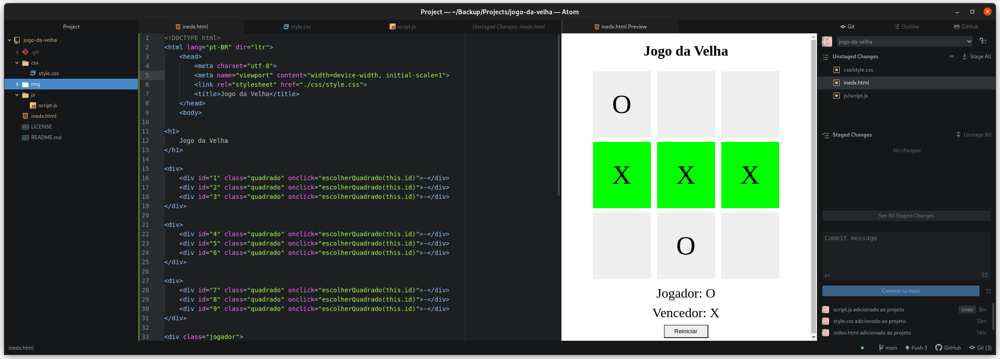

# Jogo Da Velha

 Jogo da velha com HTML e Javascript

 Jogo da velha, utilizando somente HTML para estruturação da página, CSS para estilização e Javascript para criar interações, jogadores e suas jogadas até qe haja um vencedor.

## Tecnologias
- HTML
- CSS
- Javascript

Este projeto é parte do Bootcampo **JavaScript Game Developer** da Dio, que
contou com a mentoria do Vitor Ruschoni
.
